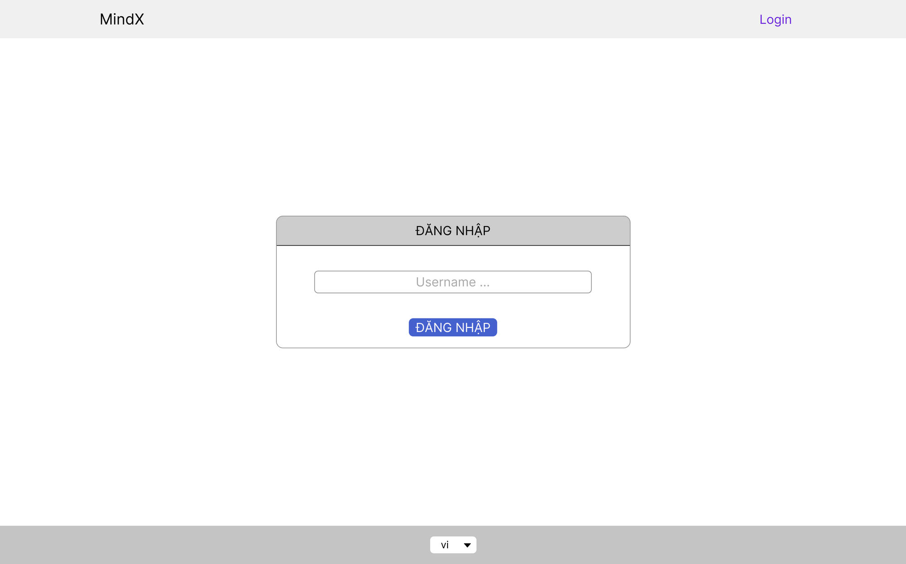

- Chữa BTVN: Using fetch + useEffect to implement CRUD operations for Todo List
- BTVN:
    
    1. Khi người dùng click đăng nhập:
       + Hiển thị: “Welcome, {username}” thay vì “Login” ở Navigation bar.
       + Màn hình chính hiển thị tin nhắn chào mừng thay vì form login.
    2. Khi người dùng đổi ngôn ngữ, tiến hành thay đổi ngôn ngữ các label trong ứng dụng.
